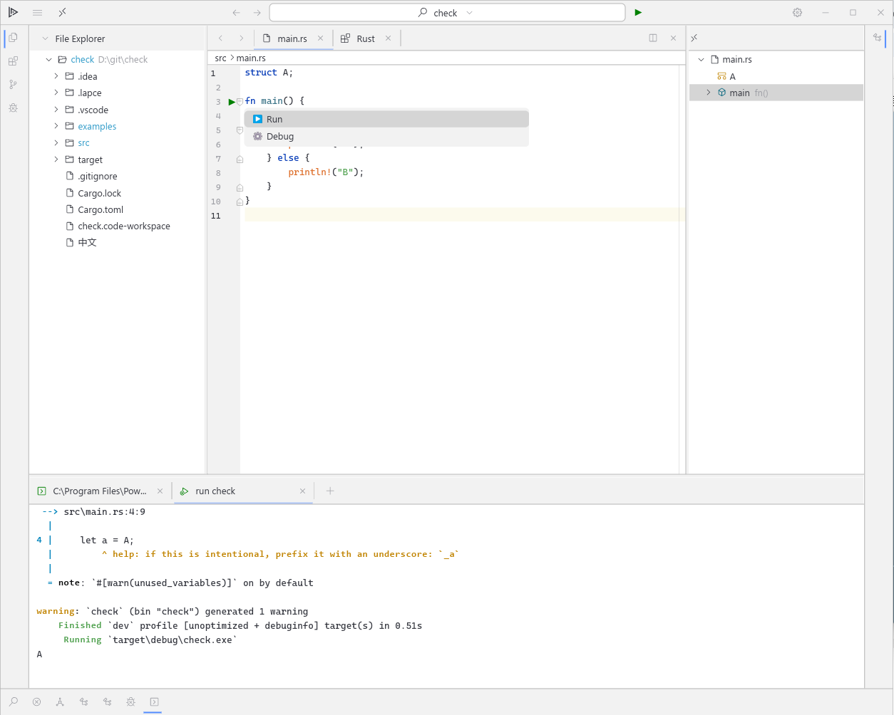

# Cozy Lapce

**Cozy Lapce** is a lightweight fork of [Lapce](https://github.com/lapce/lapce), aiming to maintain and simplify this excellent code editor.

📘 中文版说明请见：[README.zh-CN.md](./README.zh-CN.md)

---

## Differences from Lapce

-  **No Modal Editing**: Modal (Vim-style) editing is not supported, as the author doesn't use or maintain it
-  **Windows And Linux Only**: Currently only tested and used on Windows and Linux; macOS are unverified
-  **Theme Simplified**: Original themes like `Lapce Light/Dark` are no longer maintained. Only `jb-light` is actively used
-  **Mouse Enhancements**: Many UI operations are now accessible via mouse (e.g., right-click menus, tabs)
-  **Code Folding Added**: Editor supports foldable regions (functions, structs, etc.) with persistent state
-  **Under-the-Hood Optimizations**:
    - Removed multi-threading, replaced with async/await
    - Avoid large memory copies
    - More fine-grained configuration options
-  **Rust-First Development**: Recommended extensions include [Rust (by dzhou121)] and `Crates`. Support for other languages is not yet verified
-  **Debugging is only supported on Windows**: To enable debugging features such as breakpoints, step execution, and variable inspection, install the [lldb-win](https://github.com/llvm/llvm-project/releases) plugin. Once installed, the editor will use the `lldb` backend to provide full debugging capabilities on Windows.

---

## 📘 Usage Guide

For more details on how to get the most out of Cozy Lapce,  
please see the [**Usage Guide**](./docs/USAGE.md).

> Covers setup tips, shortcuts, debugging configuration, theme customization, and more!

For more details on developing of Cozy Lapce,
please see the [**DEVELOPING Guide**](./docs/DEVELOPING.md).

## Roadmap

- 🤖 **AI Assistance**: Exploring the possibility of AI-powered code completions, inline suggestions, chat-based refactoring, etc.
---

## Contribute to Cozy Lapce
Cozy Lapce started as a personal editor for everyday use — but we’d love for it to grow with help from the community!

You’re warmly welcome to contribute in any of the following ways:

🧑‍💻 Cross-platform support – Help test or adapt Cozy Lapce for Linux and macOS

🎨 UI / Theme improvements – Refine the look & feel, design better themes

🐞 Fix bugs & enhance features – Submit pull requests or open issues

🧪 AI – Join efforts in building AI-assisted tools

💡 Have a better idea? Share your thoughts or suggestions — we're listening!

Open an issue, or submit a PR anytime!

---

## 🙏 Acknowledgement

**This project is built on top of [Lapce](https://github.com/lapce/lapce). Huge thanks to the original authors and the open-source community for their amazing work.**

---
