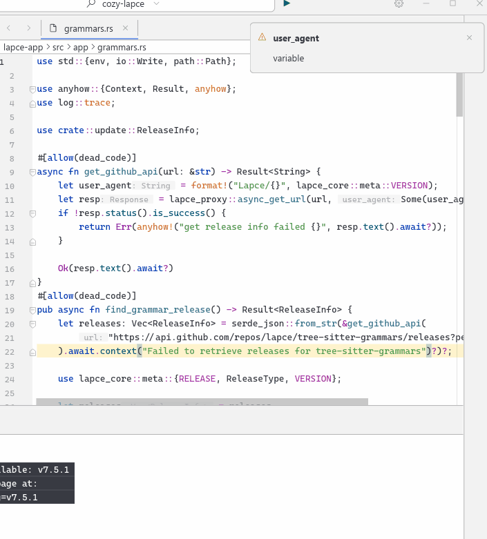

# About Development

## 🔍 Quickly Locate GUI Code

To quickly identify and navigate to the source code behind a UI element, use the built-in UI inspector.

1. **Press `F11`** to open Inspector mode;
2. **Click** on the UI element you're interested in;
3. **Use the ↑/↓ arrow keys** to move up or down the node hierarchy to locate the exact UI node;
4. **Right-click** the selected node, it will auto copy the name of node ;
5. **Search** for that name in your editor’s global search panel to locate the corresponding code.

> 🧠 Tip: Nodes with a meaningful `name` are usually the best entry point for code navigation.

---

# 🎨 About Theme Development

## ✅ How to Inspect Semantic Types in the Code Area

To quickly find out what semantic type is used for a particular code element (e.g., a keyword, string, comment):

1. **Right-click** directly on the code element (e.g., a variable, keyword, string literal);
2. Select **“Inspect Semantic Type”** from the context menu;
3. A popup will appear showing the semantic type

