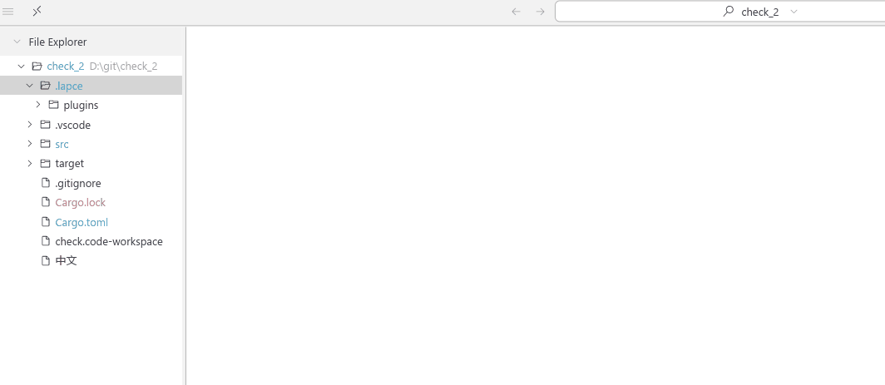
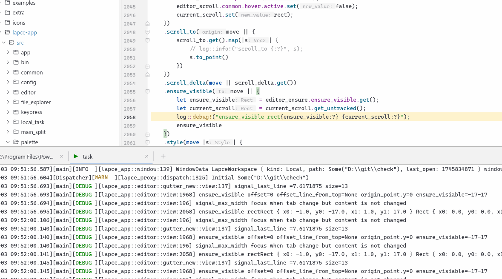
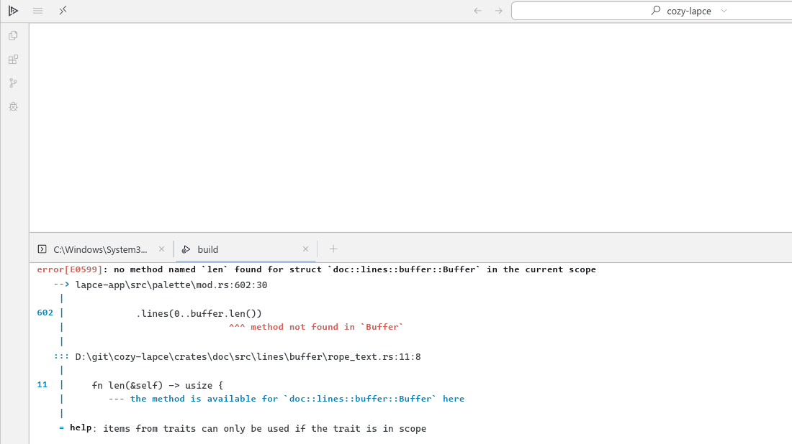
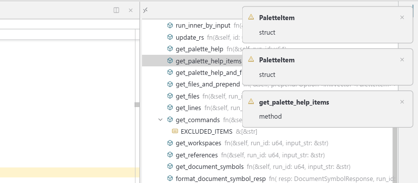

## 📚 Table of Contents

### Run And Debug
- [Quickly Add a Run Configuration](#quickly-add-a-run-configuration)
- [Quickly Restart the Current Task](#quickly-restart-the-current-task)
- [Debugging: Use the Executable, Not `cargo run`](#debugging-use-the-executable-not-cargo-run)

### Coding
- [Navigate Diagnostics and Show Fixes](#navigate-diagnostics-and-show-fixes)
- [⭐️⭐️⭐️Quickly Locate Log Code from Terminal](#quickly-locate-log-code-from-terminal)
- [Quickly Locate Error Code from Terminal](#quickly-locate-error-code-from-terminal)

### Other
- [Copy Terminal Output](#copy-terminal-output)
- [Inspect Syntax Type for Theme Customization](#inspect-syntax-type-for-theme-customization)
- [Quickly Dismiss Popup Messages](#quickly-dismiss-popup-messages)

# Run And Debug

## Quickly Add a Run Configuration

To quickly create a run configuration template:

1. Right-click on `run.toml` and choose **`Add Run Debug Config`** from the context menu;
2. A configuration template will be automatically generated—just edit it as needed.



## Quickly Restart the Current Task

You can restart the current running task in two ways:

1. Press the shortcut key **`Run and Debug Restart Current Running`** to quickly restart the current task;
2. Alternatively, right-click inside the **terminal** and choose **“restart”** from the context menu;

> ⚠️ If you've made changes to the configuration (e.g. updated environment variables),  
> you should **reselect and run the task from the palette** to ensure the latest settings take effect.

## Debugging: Use the Executable, Not `cargo run`

When setting up a debugging task, make sure to **directly specify the path to the compiled `.exe` file**,  
instead of using `cargo run`.

> ⚠️ `cargo run` starts a build process and wraps your executable, which can interfere with debugging.  
> For accurate breakpoints and stack traces, it's best to launch the actual binary (e.g. `target/debug/your_app.exe`).

To enable debugging, simply add the following line to your run configuration, e.g:

```
[[configs]]
# the name of this task
type = "lldb"
name = "debug-cozy-lapce"
program = "./target/debug/cozy-lapce.exe"
args = ["-w", "-n"]
[configs.prelaunch]
program = "cargo"
args = [
  "build", "--bin", "cozy-lapce", "--features", "dev", "--no-default-features"
]
[configs.env]
https_lapce_proxy = "http://127.0.0.1:7897"
lapce = "info,naga=warn,wgpu_hal=error,wgpu_core=error,alacritty_terminal=error,lapce_proxy::plugin::dap=debug"
```

# Coding

## Navigate Diagnostics and Show Fixes

You can quickly jump to diagnostics and view available fixes with the following shortcuts:

1. Press **`Next Error in Workspace`** or **`Previous Error in Workspace`** to navigate between errors;
2. Press **`Next Warn in Workspace`** or **`Previous Warn in Workspace`** to navigate between warnings;
2. Press **`Show Code Actions`** to show the list of available code actions (such as quick fixes or imports).

> 💡 This helps you quickly locate issues and apply fixes without leaving the keyboard.


### ⭐️⭐️⭐️Quickly Locate Log Code from Terminal

In the terminal, **Ctrl+clicking** on a log like `[lapce_app::window_workspace:2755]` will jump directly to the line of code where the log was printed.



## Quickly Locate Error Code from Terminal

When an error message appears in the terminal (e.g. during build or run),  
you can **hold `Ctrl` and click** on the file path and line number to jump directly to the source code.




# Other

## Copy Terminal Output

To copy text from the terminal:

1. **Select** the content you want to copy directly in the terminal;
2. Then, **right-click on the selected content** to automatically copy it to the clipboard, and a confirmation message will appear in the status bar.

> ⚠️ Note: You must right-click within the selected content. 
> The current terminal output experience is not very polished.  
> We plan to improve its usability in future versions.

## Inspect Syntax Type for Theme Customization

If you want to customize the editor theme, you can inspect the semantic type of any code token:

1. **Right-click** on the code you’re interested in;
2. From the context menu, select **`Inspect Semantic Type`** (or similar);

This will display the semantic type of the selected token (e.g. `keyword`, `function`, `variable`, etc.).

> 🎯 Knowing the exact syntax type helps you target the correct scope when adjusting theme colors.

## Quickly Dismiss Popup Messages

To quickly close pop-up messages (such as diagnostics, errors, or tips):

- **Double-click** anywhere on the message panel.


